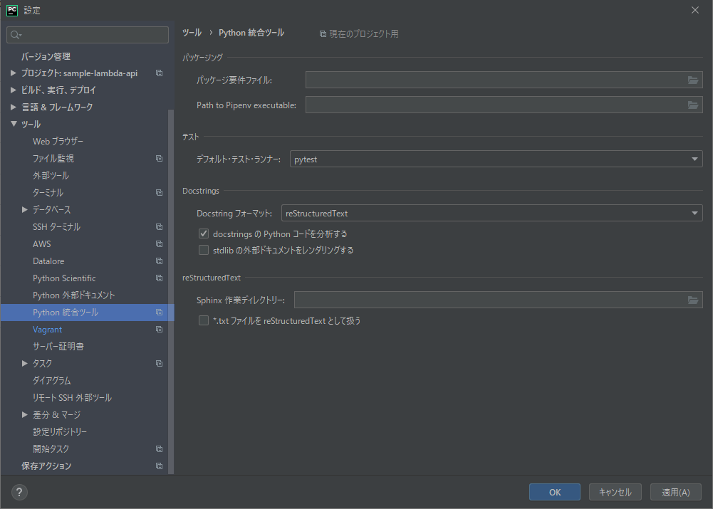
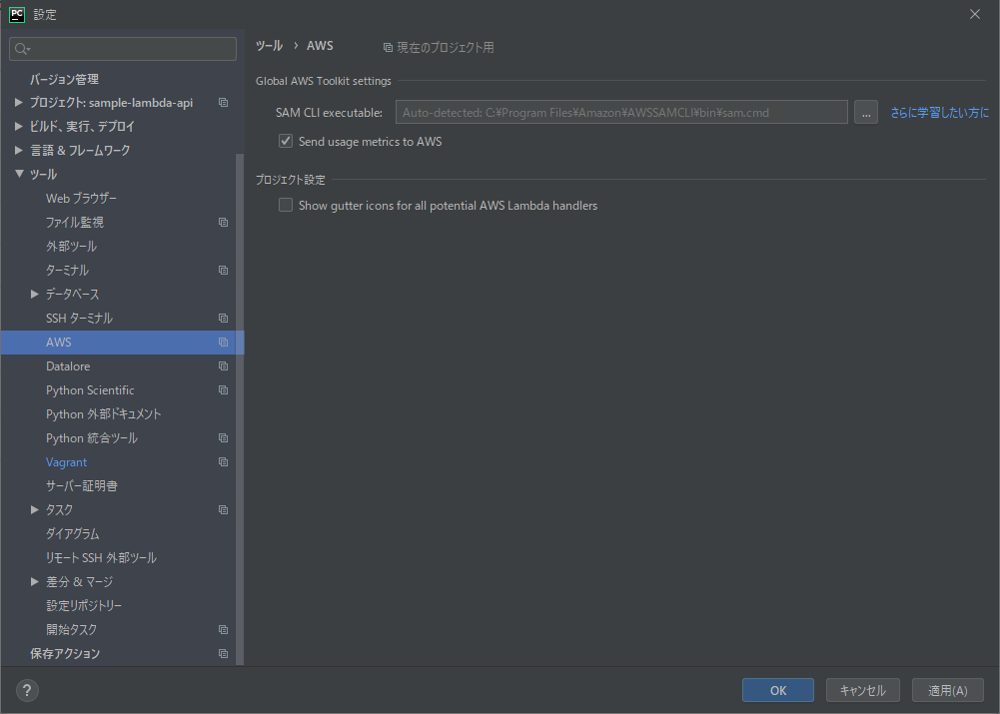
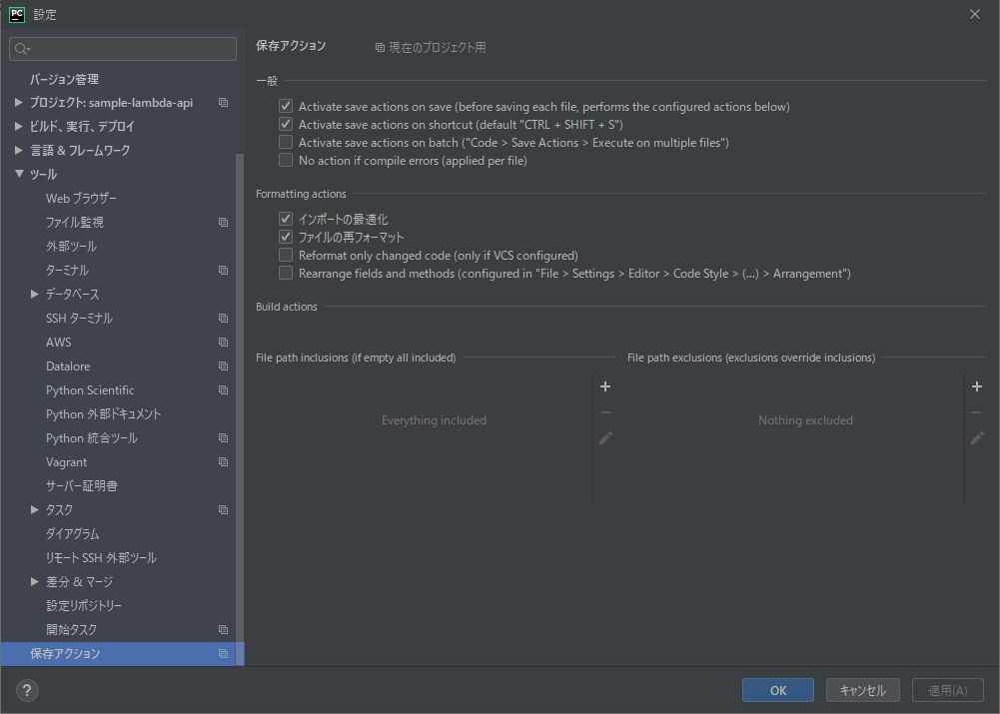
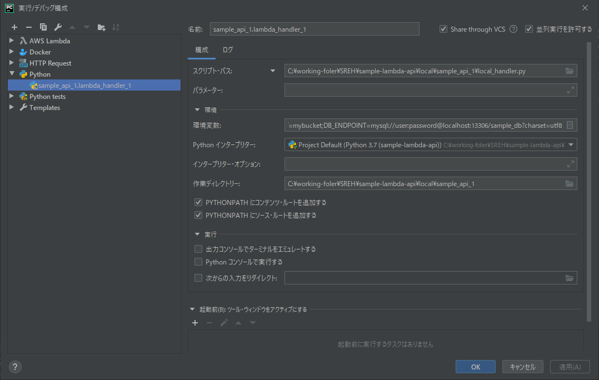
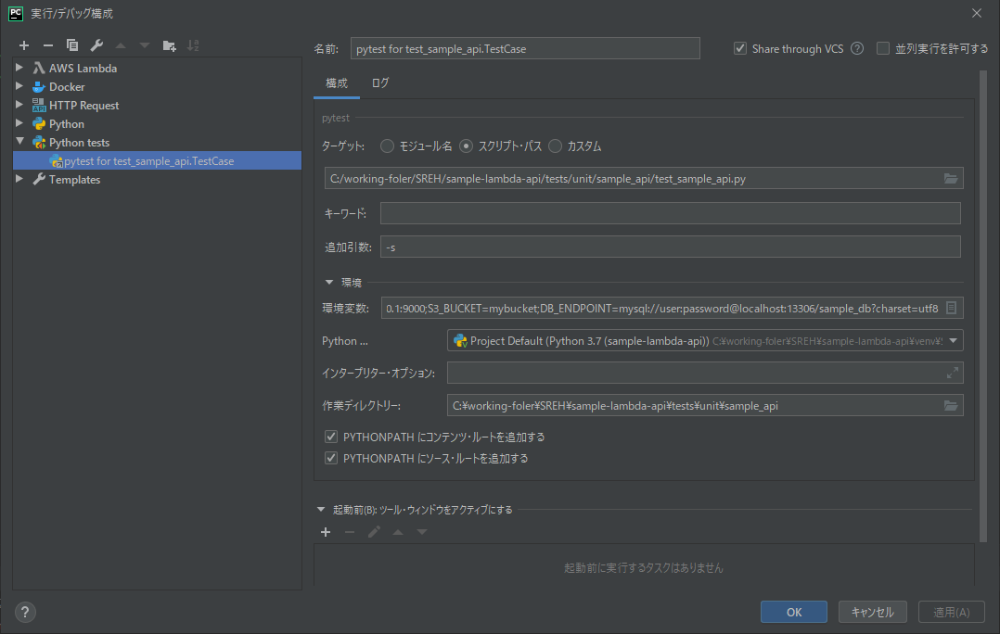

= ローカル環境での起動方法
:toc:
:sectnums:

== PyCharmの前作業

=== pip install

ルートディレクトリ直下にある、requirements_local.txtに記載しているライブラリ群をインストールする。

```
pip install -r requirements_local.txt
```

=== プラグインの導入

ファイル > 設定 > プラグイン > マーケットプレース より、下記のプラグインをインストールする。

* AWS Toolkit
* AsciiDoc
* Requirements
* Save Action

=== ツールの設定

ファイル > 設定 より、下記のツール等の設定を行う。

==== pytest



==== AWS Toolkit



==== Save Action



=== AWS Profileの設定

PyCharmの右下にある、AWSの文字を押下し、AWS Profile設定ファイルを開く。 +
Profile設定ファイルを以下の通りに設定する。

==== credentials

自身のIAM Userのアクセスキー、シークレットキーを定義する。

```
[root]
aws_access_key_id = *************
aws_secret_access_key = ************************************
```

==== config

リージョンやAWS CLIコマンドのoutputを定義する。 +
AssumeRole（スイッチロール）するRoleを定義する。

```
[profile root]
region = ap-northeast-1
output = json

[profile SREH_dev]
role_arn  = arn:aws:iam::136315317978:role/*******************
source_profile = root
region = ap-northeast-1
output = json
```

== アプリ実行

ローカル環境でのアプリ実行方法は、local_handler.pyを実行し、local_handler.pyがアプリを実行させる方針とする。

SAMでアプリを実行できるが、実行までに時間がかかるため、今回はこの方法を使わない。 +
時間がかかる理由は、SAMの場合、まずコンテナが立ち上がり、このコンテナ上でアプリが実行されるが、このコンテナを立ち上げるのに時間がかかる為である。

PyCharmより、下記のような実行構成を設定しlocal_handler.pyを実行する。



== テストコード実行

PyCharmより、下記のような実行構成を設定し対象のtest_*.pyを実行する。

