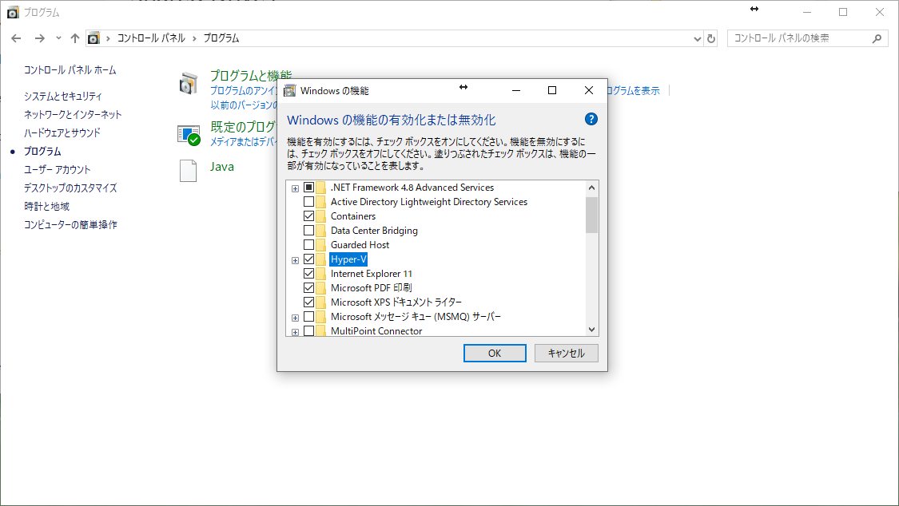
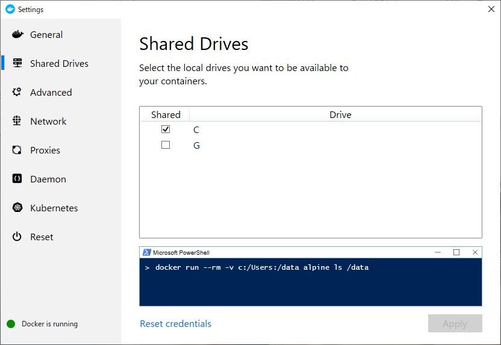
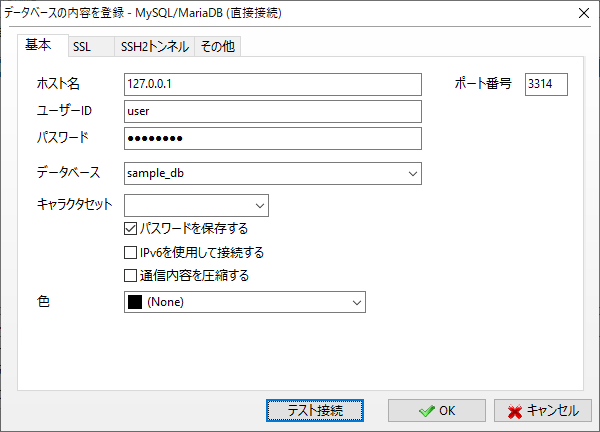
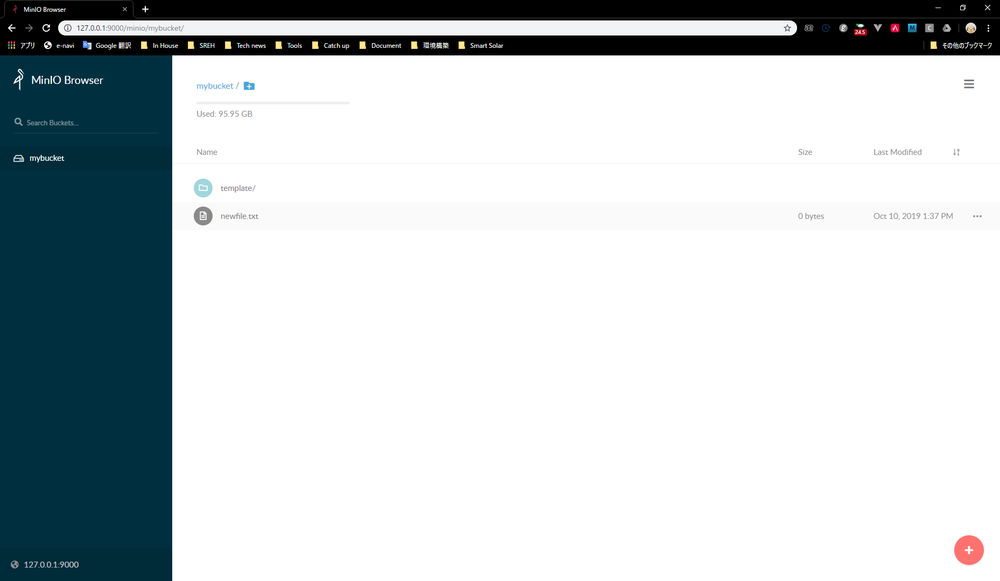

= ローカル開発環境の構築
:toc:
:sectnums:

== 方針

[cols="1,2"]
|===
| 言語 | Python3.7
| フレームワーク | SAM
| デプロイ先 | Lambda
| IDE | PyCharm
|===

=== docker-compose

[cols="1,2"]
|===
| RDS | https://hub.docker.com/_/mysql[mysql Image]
| S3 | https://hub.docker.com/r/minio/minio/[minio Image]
| SES | 開発環境用AWSアカウントの実サービス
| Cognito | 開発環境用AWSアカウントの実サービス
|===

== 起動手順

=== ソフトウェア群のインストール

以下のソフトウェア群をインストールする。 +
インストーラーは、リンク先のGoogleドライブにあるものを使用すること。

* https://drive.google.com/drive/folders/1tZuLRQ4XYNiz4Lc_7X_tAXG90C6RIJfZ[Docker for Windows]
* https://drive.google.com/drive/folders/1HWMQETnHsP0oVwZyBTEW-QGaPEQkAZzk[docker-compose]
* https://drive.google.com/drive/folders/1TiPiViotIpzH5lMS2lfRumROmmTO1Fbw[SAM CLI]

あると便利なソフトウェア

* https://drive.google.com/drive/folders/1a31aDp1TmuQTG79gqRcPP5sWNltGAdLX[A5M2]
* https://drive.google.com/drive/folders/1hOkD9hkD1-EMxZ5CCnLEG0DR3M88n_pV[AWS CLI]

=== Hyper-Vの有効化

コントロールパネル > プログラム > Windowsの機能の有効化または無効化　の順に選択し、下記のポップアップが表示させる。 このポップアップよりHyper-Vを有効化する。



CAUTION: Hyper-Vを有効化すると、CPUを占有されてしまうため、VirtualBoxなどのホスト型の仮想サーバを起動できなくなる。

=== Docker Shared Drive

Docker for Windows > settings > Shard Drive の順に選択し、C Driveをチェック、Applyをする。



=== コンテナ起動

リポジトリ直下のフォルダ上でターミナルを起動し、次のコマンドを実行する。

```
docker-compose up -d
```

すると、docker-compose.ymlに定義しているコンテナ群が起動される。 +
起動中のコンテナを確認する際は、次のコマンドを実行する。

```
docker-compose ps
```

コンテナ群を停止する際は下記のコマンド。

```
docker-compose down
```

== mysqlコンテナ

=== DBの操作方法

==== mysqlコマンド

```
mysql --host 127.0.0.1 --port 13306 -u user -p
```

==== mysqlクライアントツール

起動手順の過程でインストールしたツールA5M2を使い、下記のようにDBにmysql接続を行う。



=== DBの初期化スクリプト

下記のフォルダに配置することで、コンテナを初回起動した時のみ実行されるスクリプトを指定できる。 +
なお、指定できるファイルは、sqlとshの2つである。

```
sample-lambda-api/mysql/initdb.d/
```

=== データの永続化

mysqlコンテナのDBデータを下記のフォルダにマウントすることで、データの永続化を行っている。 +
そのため、DBを初期状態にしたい場合は、下記のフォルダ配下のファイル群を削除した後、再度コンテナを起動する必要がある。

```
sample-lambda-api/mysql/mysql/mysql_data/
```

== S3コンテナ

=== S3の操作方法

==== MinIO Browser



==== AWS CLI

```
>aws configure
AWS Access Key ID [****************ZMEL]: techfun
AWS Secret Access Key [****************azQa]: techfuntechfun
Default region name [ap-northeast-1]:
Default output format [json]:

>aws --endpoint-url http://127.0.0.1:9000 s3 ls
2019-10-10 13:37:56 mybucket
```

==== ライブラリ

Minioが提供しているライブラリや、AWSが提供しているライブラリを使いS3を操作する。 +
今回は、基盤がAWSで言語はPythonであるため、boto3を使う。

=== データの永続化

S3コンテナ上でBucket情報及び、Bucket内のデータを保管しているフォルダをホスト上の下記のフォルダにマウントしている。 +
S3 Bucket・Bucket内のデータは、下記フォルダに配置する。

```
sample-lambda-api/s3/bucket/
```